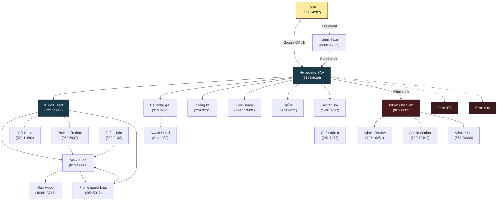

# SCREENFLOW — SAA 2025 (Sun Annual Awards / Sun* Kudos)

**File Key**: `9ypp4enmFmdK3YAFJLIu6C`
**Updated**: 2026-03-24

---

## Overview

SAA 2025 (Sun* Kudos) là ứng dụng web cho phép nhân viên Sun* gửi lời chúc (Kudos) cho nhau trong khuôn khổ sự kiện Sun Annual Awards 2025. Ứng dụng bao gồm các luồng chính:

1. **Authentication**: Login bằng Google → vào hệ thống
2. **Kudos Flow**: Xem feed → Viết/Sửa/Xem Kudo → Tương tác
3. **Profile**: Xem profile bản thân/người khác, danh hiệu, huy hiệu
4. **Awards & Rules**: Hệ thống giải thưởng, thể lệ
5. **Statistics & Live Board**: Thống kê, bảng live
6. **Secret Box**: Mở hộp quà bí mật
7. **Admin**: Quản lý nội dung, campaign, user

---

## Main User Screens

| # | Screen Name | Frame ID | Figma Node | Purpose |
|---|------------|----------|------------|---------|
| 1 | Login | `662:14387` | `662:14387` | Entry point — đăng nhập Google OAuth |
| 2 | Countdown - Prelaunch | `2268:35127` | `2268:35127` | Trang đếm ngược trước khi sự kiện bắt đầu |
| 3 | Homepage SAA | `2167:9026` | `2167:9026` | Trang chủ sau đăng nhập — tổng quan sự kiện |
| 4 | Sun* Kudos Feed | `335:11943` | `335:11943` | Feed hiển thị tất cả kudos |
| 5 | Viết Kudo | `520:11602` | `520:11602` | Tạo kudo mới — chọn người nhận, hashtag, nội dung |
| 6 | View Kudo | `520:18779` | `520:18779` | Xem chi tiết một kudo |
| 7 | Sửa bài viết (Edit) | `1949:13746` | `1949:13746` | Chỉnh sửa kudo đã viết |
| 8 | Gửi lời chúc Kudos | `828:13433` | `828:13433` | Form gửi lời chúc (variant) |
| 9 | Profile bản thân | `362:5037` | `362:5037` | Trang profile cá nhân |
| 10 | Profile người khác | `362:5097` | `362:5097` | Xem profile người dùng khác |
| 11 | Award | `214:1032` | `214:1032` | Chi tiết một giải thưởng |
| 12 | Awards-Name | `214:664` | `214:664` | Danh sách giải thưởng theo tên |
| 13 | Hệ thống giải | `313:8436` | `313:8436` | Tổng quan hệ thống giải thưởng |
| 14 | Chỉ số thống kê | `256:6756` | `256:6756` | Dashboard thống kê |
| 15 | Sun* Kudos - Live Board | `2940:13431` | `2940:13431` | Bảng live realtime kudos |
| 16 | Thể lệ | `3204:6051` | `3204:6051` | Quy định, thể lệ sự kiện |
| 17 | Tất cả thông báo | `589:9132` | `589:9132` | Danh sách thông báo |
| 18 | View thông báo | `589:9152` | `589:9152` | Chi tiết một thông báo |
| 19 | Secret Box (chưa mở) | `1466:7676` | `1466:7676` | Hộp quà bí mật — trạng thái chưa mở |
| 20 | Chúc mừng | `256:7475` | `256:7475` | Màn hình chúc mừng |
| 21 | Tiêu chuẩn cộng đồng | `1161:8944` | `1161:8944` | Quy tắc cộng đồng |
| 22 | Error 403 | `2182:9291` | `2182:9291` | Trang lỗi không có quyền |
| 23 | Error 404 | `1378:5063` | `1378:5063` | Trang lỗi không tìm thấy |

---

## Admin Screens

| # | Screen Name | Frame ID | Purpose |
|---|------------|----------|---------|
| A1 | Admin - Overview | `620:7712` | Dashboard tổng quan admin |
| A2 | Admin - Review Content | `722:16251` | Duyệt nội dung kudos |
| A3 | Admin - Review Content (Search) | `832:13197` | Tìm kiếm nội dung để review |
| A4 | Admin - Setting | `820:10492` | Cài đặt hệ thống |
| A5 | Admin - Setting (Add Campaign) | `832:12113` | Thêm campaign mới |
| A6 | Admin - Setting (Edit Campaign) | `832:12299` | Chỉnh sửa campaign |
| A7 | Admin - User | `773:26403` | Quản lý người dùng |

---

## Overlay / Dropdown Components

| Component | Frame ID | Trigger |
|-----------|----------|---------|
| Dropdown ngôn ngữ | `721:4942` | Click language selector trên Header |
| Dropdown Profile | `721:5223` | Click avatar trên Header |
| Dropdown Profile Admin | `721:5277` | Click avatar (admin role) |
| Dropdown Hashtag Filter | `721:5580` | Click filter hashtag trên Feed |
| Dropdown Phòng ban | `721:5684` | Click filter phòng ban |
| Notification Panel | `186:2100` | Click icon thông báo trên Header |
| Hover Avatar Info | `721:5827` | Hover lên avatar user |
| Alert Overlay | `3127:24672` | System alerts |
| Floating Action Button | `313:9137` | Nút nổi tạo kudo mới |

---

## Navigation Flow

---

## Key Navigation Rules

1. **Unauthenticated** → Luôn redirect về Login
2. **Authenticated** → Truy cập Login sẽ redirect về Homepage
3. **Admin routes** → Chỉ user có role admin mới truy cập được, ngược lại hiển thị Error 403
4. **Header** xuất hiện ở tất cả trang (trừ Login, Prelaunch, Error pages) — chứa: Logo, Navigation, Language selector, Notification, Profile dropdown
5. **Floating Action Button** xuất hiện ở Feed và Homepage — cho phép tạo Kudo nhanh
6. **Language** được chọn ở bất kỳ trang nào, áp dụng toàn bộ ứng dụng

---

## Notes

- Tất cả frames hiện ở trạng thái `design` — chưa có frame nào ở `spec`, `dev`, `review`, hay `done`
- Nhiều frames là UI components (Button, IC, Image, etc.) — không phải màn hình chính
- Một số màn hình có nhiều variants (Secret Box có ~10 trạng thái khác nhau)
- Login là màn hình đầu tiên được spec (hiện tại)
